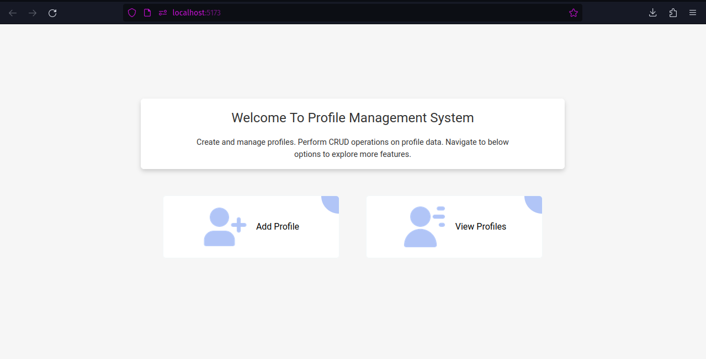
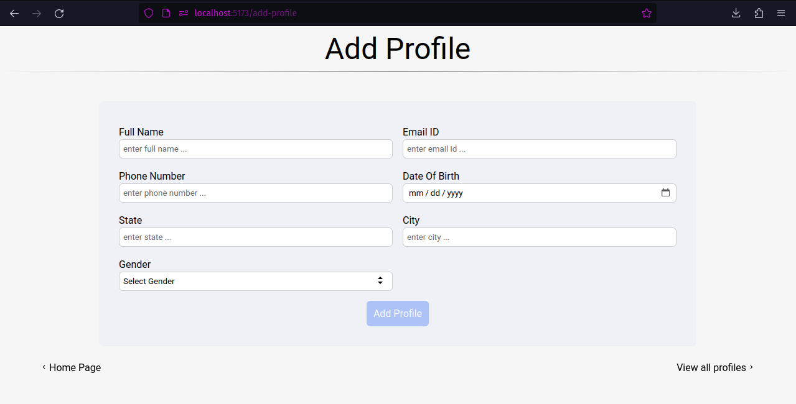
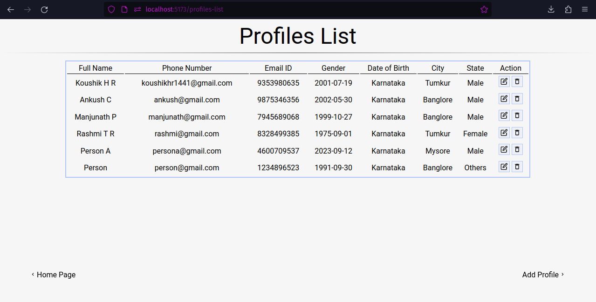

# Profile Management System

## React + Vite + Typescript

Through the project PMS - Profile Management System naming convention is followed.

### Project Structure

- [router] for routes definition.
- [container] for individual pages/routes.
- [component] for reusable react components.
- [utils] for logic functions and interfaces/types.
- [assets] for any images or logos.

### Project Screens





## Installation

This project requires [Node.js](https://nodejs.org/) v10+ to run.

Install the dependencies and devDependencies and start the server.

```sh
cd profile-management
npm i
npm run dev
```

now visit (http://localhost:5173/)

## Plugins

This project is currently extended with the following plugins.
Instructions on how to use them in your own application are linked below.

| Plugin          | README                                     |
| --------------- | ------------------------------------------ |
| Vite            | https://vitejs.dev/                        |
| React Router    | https://reactrouter.com/en/main            |
| Typescirpt      | https://www.typescriptlang.org/            |
| React Icons     | https://react-icons.github.io/react-icons/ |
| React Form Hook | https://react-hook-form.com/               |
